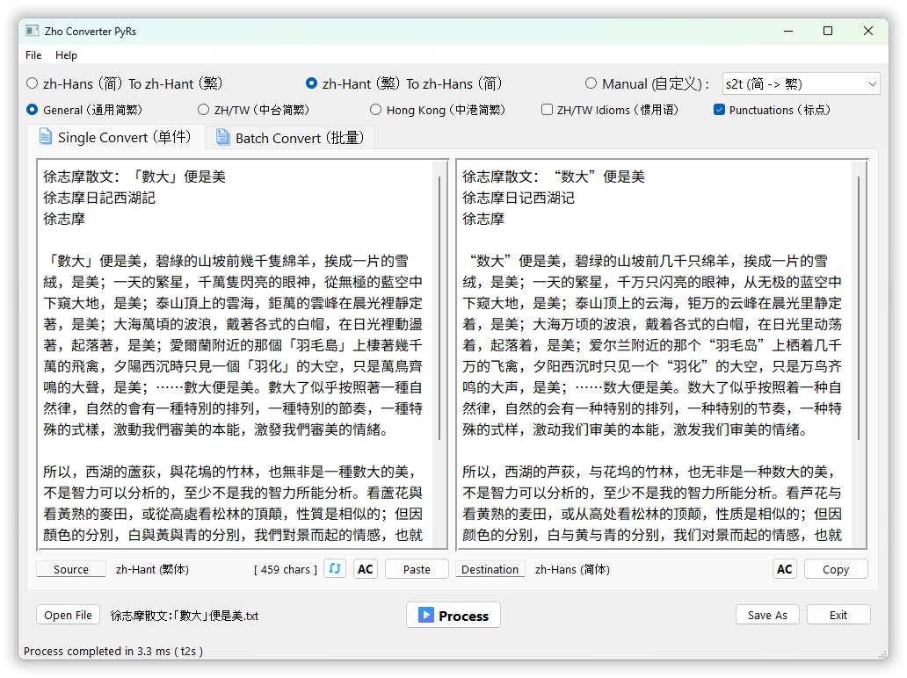
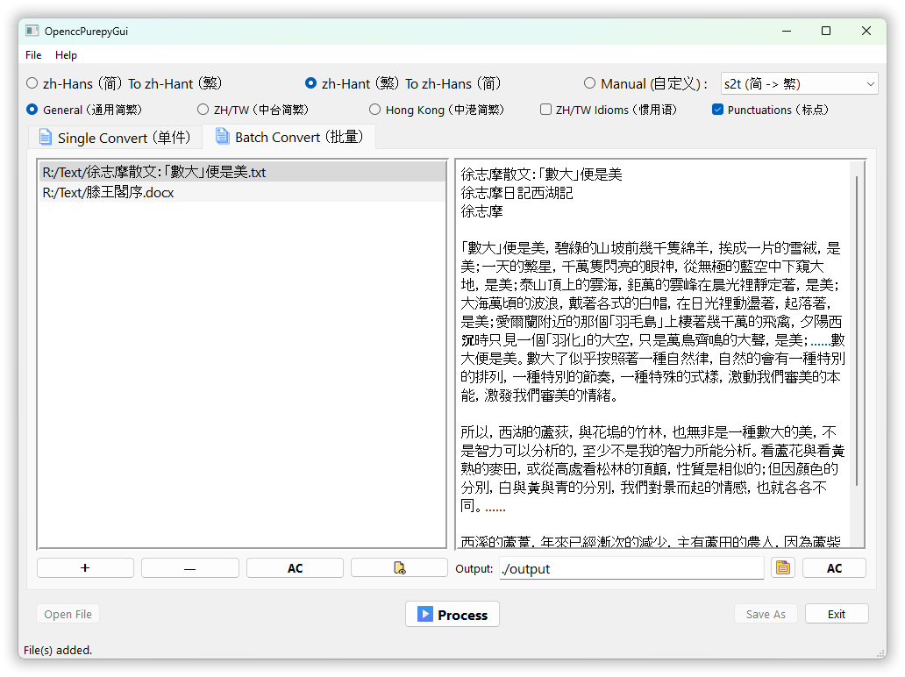
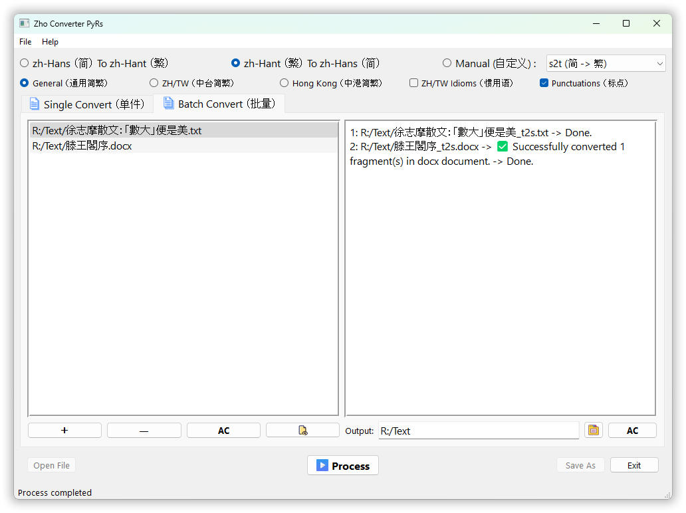

# OpenccPurepyGui

[](https://github.com/laisuk/OpenccPurepyGui/releases/latest)
[](https://github.com/laisuk/OpenccPurepyGui/releases)
[](https://github.com/laisuk/OpenccPurepyGui/releases/latest)
[](LICENSE)


**OpenccPurepyGui** is a cross-platform desktop application for Chinese
text and document conversion, built with **Python**, **PySide6**, and **Qt**.

It uses [opencc-purepy](https://github.com/laisuk/opencc_purepy), a
pure-Python OpenCC implementation, to provide conversion between
Simplified Chinese, Traditional Chinese, Taiwan variants, Hong Kong
variants, and Japanese Shinjitai.

## Download

Download the latest release from the [GitHub
Releases](https://github.com/laisuk/OpenccPurepyGui/releases/latest)
page.

Release builds are packaged as **self-contained applications**. A
separate Python installation is not required.

Available release targets include:

- **Windows x64** --- portable self-contained application and MSI
  installer
- **Linux x64** --- self-contained application archive
- **macOS Intel (x64)** --- self-contained application archive
- **macOS Apple Silicon (ARM64)** --- self-contained application
  archive

> The Python instructions later in this README are only for users who
> want to run the application directly from source.

## Features

### Chinese conversion

- **Simplified ↔ Traditional Chinese conversion**
- **Taiwan Traditional variants and phrases**
- **Hong Kong Traditional variants and phrases**
- **Traditional Chinese ↔ Japanese Shinjitai**
- **Optional punctuation conversion**
- **Normalize Compat** for Unicode compatibility normalization
- **DeTofu** for replacing rare CJK extension characters with display-compatible alternatives

### Text files

- Open, edit, convert, and save plain-text files
- Automatic **CJK text encoding detection**
- Manual text encoding selection and reload
- Drag-and-drop file support
- Single-file and batch conversion
- Optional filename conversion in batch mode

### PDF

- Extract text from PDF documents
- Convert extracted PDF text using the selected OpenCC configuration
- Optional **page headers**
- Optional **compact extracted text**
- Optional **automatic text reflow**
- PDF support is based on text extraction; the original PDF layout is
  not rewritten

### Office, OpenDocument, and EPUB

OpenccPurepyGui can convert text inside supported document containers
while preserving the document structure.

Supported formats:

- Microsoft Word (`.docx`)
- Microsoft Excel (`.xlsx`)
- Microsoft PowerPoint (`.pptx`)
- OpenDocument Text (`.odt`)
- OpenDocument Spreadsheet (`.ods`)
- OpenDocument Presentation (`.odp`)
- EPUB (`.epub`)

## Usage

### Single Mode



Single mode is designed for interactive text and file conversion.

1. Paste text into the source editor, or open/drag a supported file
   into the application.
2. Select the desired conversion configuration.
3. Configure optional conversion settings as needed.
4. Click **Process** to convert the content.
5. Review or save the converted result.

For plain-text files, OpenccPurepyGui can automatically detect the
source encoding. The encoding can also be selected manually when
required.

For PDF files, the application extracts the document text before
conversion. PDF-specific options such as page headers, compact extracted
text, and automatic reflow can be configured in the application.

### Batch Mode





Batch mode supports plain-text files, PDF documents, Office/OpenDocument
documents, and EPUB files.

1. Select or drag one or more files into the source list.
2. Select the desired conversion configuration.
3. Set the output folder.
4. Enable **Convert Filename in batch mode** from the **File** menu if
   filename conversion is required.
5. Click **Process** to begin batch conversion.

Supported document formats include:

`PDF` · `DOCX` · `XLSX` · `PPTX` · `ODT` · `ODS` · `ODP` · `EPUB`

## Conversion Configurations

OpenccPurepyGui supports the standard conversion configurations provided
by `opencc-purepy`, including:

| Configuration | Conversion                                               |
|---------------|----------------------------------------------------------|
| `s2t`         | Simplified Chinese → Traditional Chinese                 |
| `t2s`         | Traditional Chinese → Simplified Chinese                 |
| `s2tw`        | Simplified Chinese → Taiwan Traditional                  |
| `tw2s`        | Taiwan Traditional → Simplified Chinese                  |
| `s2twp`       | Simplified Chinese → Taiwan Traditional with phrases     |
| `tw2sp`       | Taiwan Traditional with phrases → Simplified Chinese     |
| `s2hk`        | Simplified Chinese → Hong Kong Traditional               |
| `hk2s`        | Hong Kong Traditional → Simplified Chinese               |
| `s2hkp`       | Simplified Chinese → Hong Kong Traditional with phrases  |
| `hk2sp`       | Hong Kong Traditional with phrases → Simplified Chinese  |
| `t2tw`        | Traditional Chinese → Taiwan Traditional                 |
| `tw2t`        | Taiwan Traditional → Traditional Chinese                 |
| `t2twp`       | Traditional Chinese → Taiwan Traditional with phrases    |
| `tw2tp`       | Taiwan Traditional with phrases → Traditional Chinese    |
| `t2hk`        | Traditional Chinese → Hong Kong Traditional              |
| `hk2t`        | Hong Kong Traditional → Traditional Chinese              |
| `t2hkp`       | Traditional Chinese → Hong Kong Traditional with phrases |
| `hk2tp`       | Hong Kong Traditional with phrases → Traditional Chinese |
| `t2jp`        | Traditional Chinese → Japanese Shinjitai                 |
| `jp2t`        | Japanese Shinjitai → Traditional Chinese                 |

---

## CJK Normalization Compatibility

**CJK Normalization Compatibility** normalizes Unicode compatibility
characters into their standard CJK forms.

This helps produce consistent text before OpenCC conversion, especially
when source documents contain compatibility characters that are visually
similar or equivalent to standard CJK characters.

Normalization can be applied directly from the editor using the **Normalize Compat** command.

## DeTofu

**DeTofu** is a display-compatibility pass for rare CJK extension
characters that may appear as missing-glyph boxes ("tofu") in fonts or
applications without sufficient Unicode coverage.

It can replace mapped rare characters with display-compatible
alternatives after OpenCC conversion.

DeTofu supports configurable CJK extension levels from **Ext-B through
Ext-I**, as well as custom fallback mappings.

---

## Running from Source

The downloadable release builds are self-contained and do **not**
require a separate Python installation.

The following instructions are for developers or users who want to run
OpenccPurepyGui directly from the source repository.

### Clone the repository

``` bash
git clone https://github.com/laisuk/OpenccPurepyGui.git
cd OpenccPurepyGui
```

### Create a virtual environment

Windows:

``` powershell
python -m venv .venv
.\.venv\Scripts\Activate.ps1
```

Linux/macOS:

``` bash
python3 -m venv .venv
source .venv/bin/activate
```

### Install dependencies

``` bash
python -m pip install -U pip
python -m pip install -r requirements.txt
```

### Run

``` bash
python mainwindow.py
```

## About opencc-purepy

[opencc-purepy](https://github.com/laisuk/opencc_purepy) is the
conversion engine used by OpenccPurepyGui.

It is a pure-Python implementation of OpenCC-style Chinese conversion
with support for Simplified/Traditional Chinese, Taiwan and Hong Kong
regional variants, Japanese Shinjitai, punctuation conversion, custom
dictionaries, and DeTofu processing.

## Acknowledgements

- [OpenCC](https://github.com/BYVoid/OpenCC) --- Chinese conversion
  dictionaries and lexicon.
- [opencc-purepy](https://github.com/laisuk/opencc_purepy) ---
  pure-Python conversion engine used by this application.
- [PySide6](https://doc.qt.io/qtforpython-6/) --- official Qt bindings
  for Python.
- [Qt](https://www.qt.io/) --- cross-platform application framework.

## License

This project is licensed under the **MIT License**. See
[LICENSE](./LICENSE) for details.
