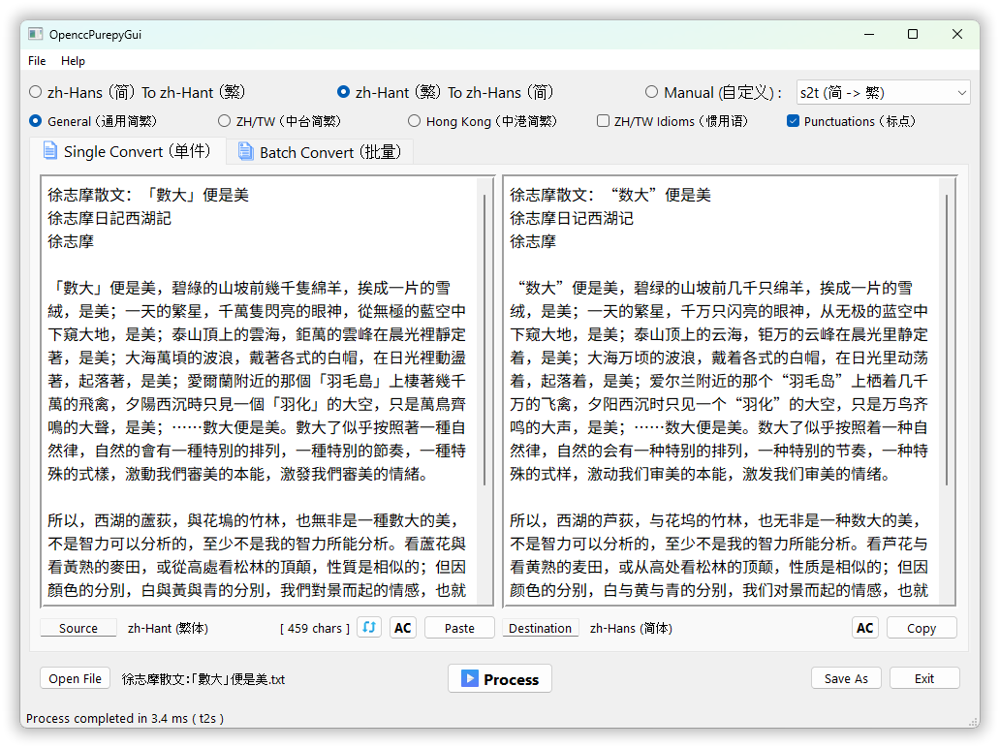
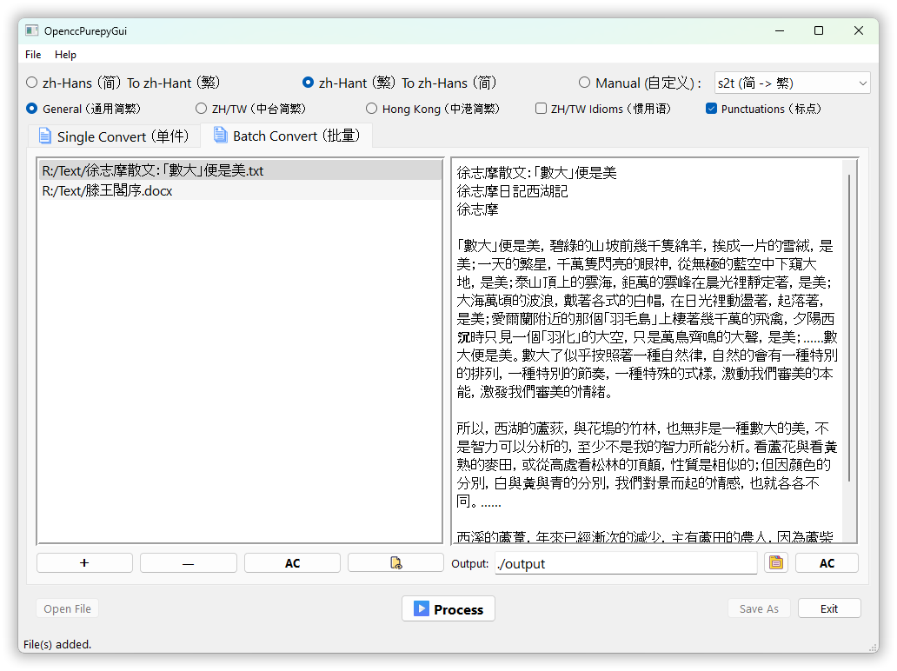
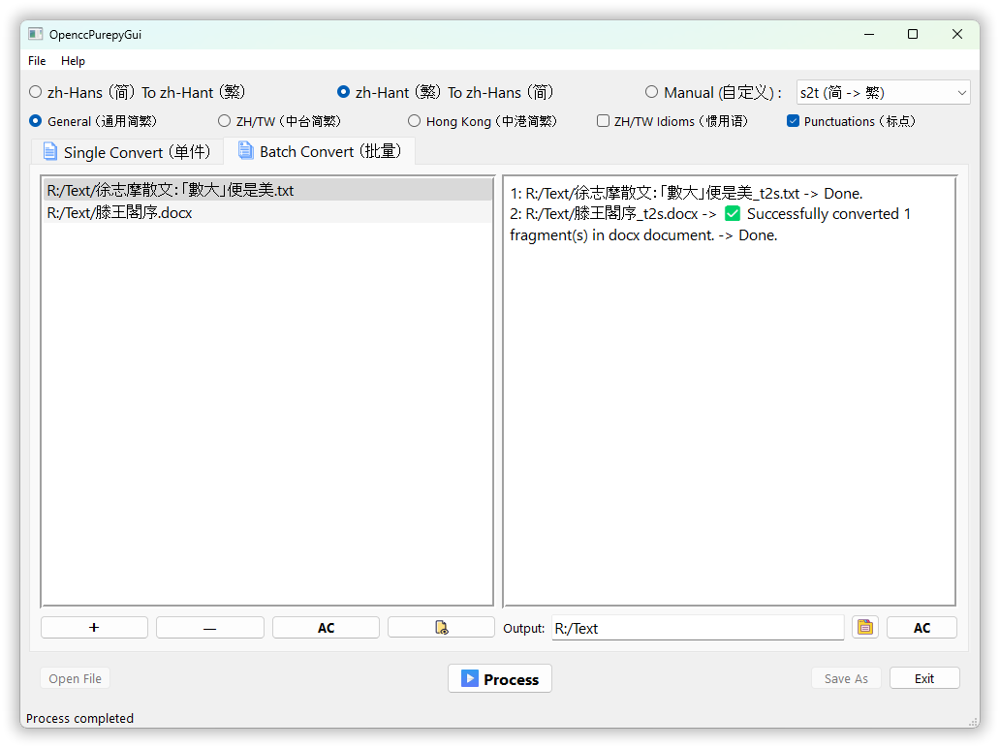

# OpenccPurepyGui

[](https://github.com/laisuk/OpenccPurepyGui/releases/latest)
[](LICENSE)

**OpenccPurepyGui** is a Chinese text conversion application built with PySide6 and the Qt design framework. It
leverages
the [opencc-purepy](https://github.com/laisuk/opencc-purepy) Python module to provide simplified and traditional
Chinese conversion.

---

## 🚀 Download

Download the latest version of **OpenccPurepyGui** for your platform
at [Release](https://github.com/laisuk/OpenccPurepyGui/releases) section.

> 📦 These are **Python Scripts**, targeting `Python 3.8+`.  
> You must have [Python 3.8+ Interpreter](https://www.python.org/downloads/) installed to run them.

---

## Features

- **Chinese Conversion**: Convert between simplified and traditional Chinese text.
- **Single/Batch Conversion**: Perform Chinese text conversion in single or batch mode.
- Designed to convert most **text based file types** and **Office documents** (`.docx`, `.xlsx`, `.pptx`, `.odt`)

---

## Dependencies

- [Pyside6](https://wiki.qt.io/Qt_for_Python): Python bindings for the Qt cross-platform application and UI framework.
  ```bash
  pip install PySide6
  ```
- [opencc-purepy](https://github.com/laisuk/opencc-purepy): Pure Python package for conversions between Traditional and
  Simplified Chinese.

---

## Getting Started

**Clone the repository**:

```bash
git clone https://github.com/laisuk/OpenccPurepyGui.git
```

**Navigate to the project directory**:

```bash
cd OpenccPurepyGui
```

**Run the application**:

```bash
python ./mainwindow.py
```

---

## Usage

### Single Mode



Support most **text base** file types.

1. Paste the text or open a file you wish to convert (file/text drag and drop are supported).
2. Select the desired conversion configuration (e.g., Simplified to Traditional).
3. Click the **Process** button to see the results.

---

### Batch Mode




Support most **text base** file types, **Office documents** (`.docx`, `.xlsx`, `.pptx`, `.odt`, `.ods`, `.odp`) and
EPUB (`.epub`).

1. Select or drag file(s) into the source list box.
2. Select the desired conversion configuration.
3. Set the output folder.
4. Click the **Process** button to begin batch conversion.

---

## License

This project is licensed under the MIT License. See the [LICENSE](./LICENSE) file for details.

---

## Acknowledgements

- [OpenCC](https://github.com/BYVoid/OpenCC) for the Chinese text conversion lexicon.
- [opencc-purepy](https://github.com/laisuk/opencc-purepy) Pure Python implementation of OpenCC for Chinese text
  conversion.
- [PySide6](https://wiki.qt.io/Qt_for_Python) Python bindings for the Qt cross-platform application and UI framework.
